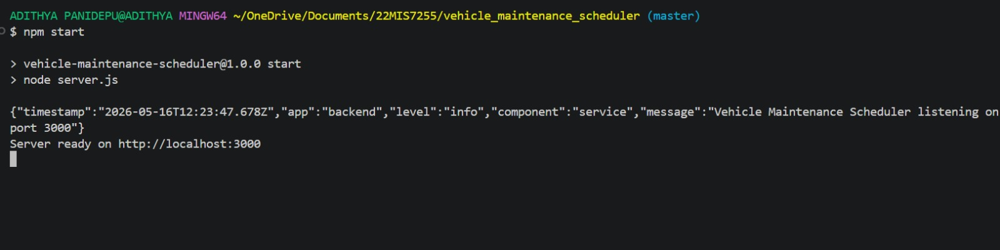
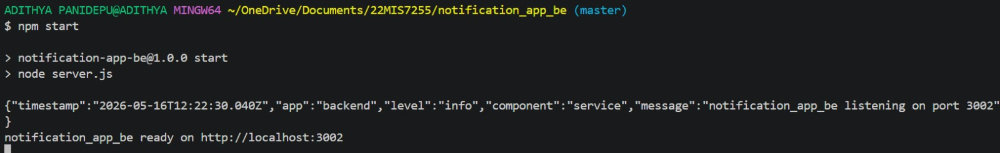
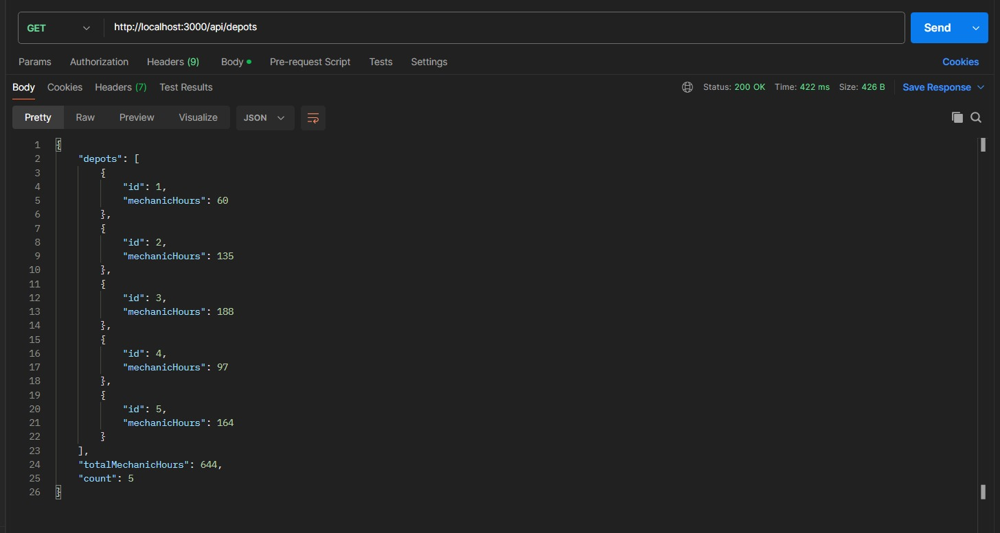
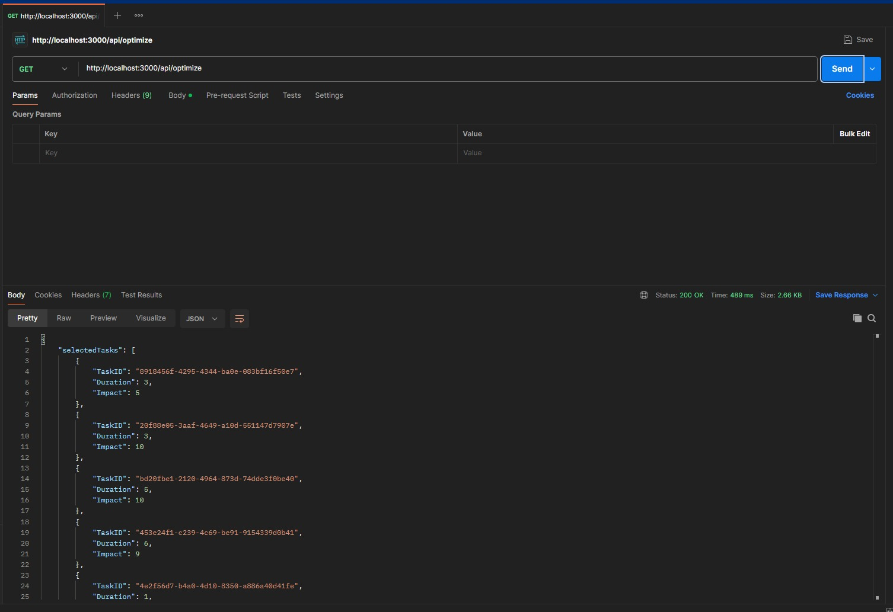
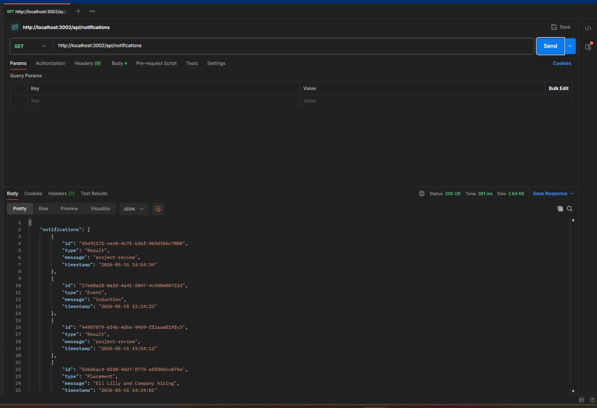
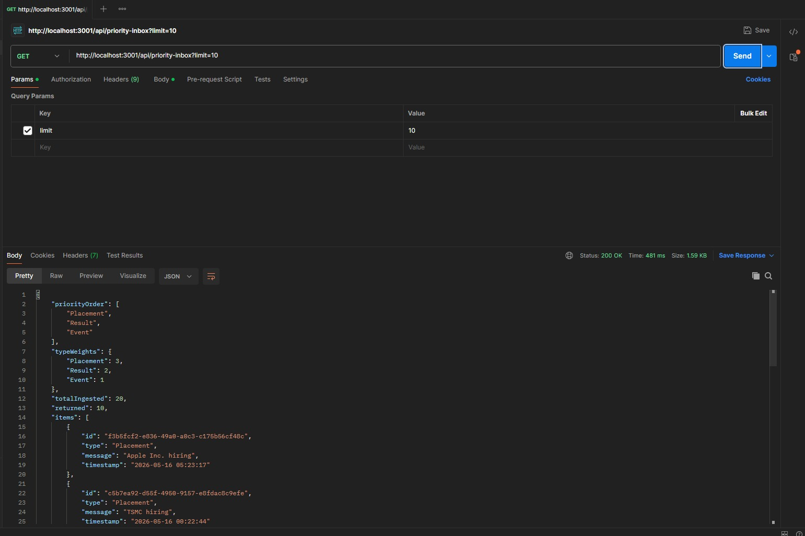

# 22MIS7255 — Backend Evaluation Submission

Backend track submission for the campus hiring evaluation.
Roll number: **22MIS7255**.

The repository is split into two independent Node services plus a shared
logging middleware package and a written design document for a notification
platform.

## Repository layout

```
22MIS7255/
├── .gitignore
├── README.md                          ← you are here
├── notification_system_design.md      ← Stages 1–6 of the notification platform design
│
├── logging_middleware/                ← reusable npm package (Log + requestLogger)
│
├── vehicle_maintenance_scheduler/     ← microservice 1 — port 3000
│                                        depots, vehicles, knapsack optimizer
│
└── notification_app_be/               ← microservice 2 — port 3002
                                         notifications, Stage 6 priority inbox
```

Both microservices share `logging_middleware/` via a local `file:`
dependency. Auth, HTTP-client, and config code is duplicated across the two
services on purpose so each one can be cloned, installed, and run on its
own.

---

## What each piece does

### `logging_middleware/`

A tiny npm package that exports:

- `Log(stack, level, package, message)` — async; ships one structured log
  line to the evaluation server's `/logs` endpoint **and** prints the same
  event as a single JSON line to stdout for local observability. Validates
  stack/level/package against the evaluator's allow-lists; never throws (a
  logging outage cannot kill the request path).
- `requestLogger(stack, package)` — Express middleware that logs the
  start and completion of every HTTP request, with status code and duration.

Sample stdout line:

```json
{"timestamp":"2026-05-16T12:22:30.040Z","app":"backend","level":"info","component":"service","message":"notification_app_be listening on port 3002"}
```

### `vehicle_maintenance_scheduler/` (port 3000)

Plans daily vehicle maintenance. Pulls the depot list (each depot has a
`MechanicHours` budget) and the vehicle/task list (each task has a
`Duration` and an `Impact`) from the evaluation server, then runs a 0/1
knapsack to pick the subset of tasks that maximises total `Impact` without
exceeding the pooled mechanic-hour budget.

| Method | Path | Purpose |
|--------|------|---------|
| `GET` | `/health` | Liveness probe |
| `GET` | `/api/depots` | Proxied depot list with totals |
| `GET` | `/api/vehicles` | Proxied vehicle/task list |
| `GET` | `/api/optimize` | Fetch both, run knapsack, return selected tasks |
| `POST` | `/api/optimize` | Run knapsack against a custom `{ tasks, mechanicHours }` body |

### `notification_app_be/` (port 3002)

Backend for the campus notification platform designed in
[`notification_system_design.md`](./notification_system_design.md).
Stage 6 (priority inbox) is implemented here as actual runnable code.

| Method | Path | Purpose |
|--------|------|---------|
| `GET` | `/health` | Liveness probe |
| `GET` | `/api/notifications` | Proxied notifications from the evaluation server |
| `GET` | `/api/priority-inbox?limit=N` | Top-N notifications, ordered `Placement > Result > Event`, ties broken by `Timestamp` desc |

---

## Sample responses

Captured live from the evaluation server during testing.

### Boot output

```
> vehicle-maintenance-scheduler@1.0.0 start
> node server.js
{"timestamp":"2026-05-16T12:23:47.678Z","app":"backend","level":"info","component":"service","message":"Vehicle Maintenance Scheduler listening on port 3000"}
Server ready on http://localhost:3000
```



```
> notification-app-be@1.0.0 start
> node server.js
{"timestamp":"2026-05-16T12:22:30.040Z","app":"backend","level":"info","component":"service","message":"notification_app_be listening on port 3002"}
notification_app_be ready on http://localhost:3002
```



### `GET http://localhost:3000/api/depots` → `200 OK`

```json
{
  "depots": [
    { "id": 1, "mechanicHours": 60 },
    { "id": 2, "mechanicHours": 135 },
    { "id": 3, "mechanicHours": 188 },
    { "id": 4, "mechanicHours": 97 },
    { "id": 5, "mechanicHours": 164 }
  ],
  "totalMechanicHours": 644,
  "count": 5
}
```



### `GET http://localhost:3000/api/vehicles` → `200 OK`

```json
{
  "vehicles": [
    { "TaskID": "75a55367-20e9-4f21-8f06-7293545564f0", "Duration": 4, "Impact": 5 },
    { "TaskID": "24b5febd-cba9-44f2-a3e2-1be00fafba6b", "Duration": 6, "Impact": 1 },
    { "TaskID": "6995848e-b7cc-4ea0-8be6-1e1f4e6a37cc", "Duration": 2, "Impact": 10 },
    { "TaskID": "8ebbc2c8-1302-420c-8db7-e2cb46ca990e", "Duration": 8, "Impact": 10 },
    { "TaskID": "5bdf49fe-62c0-41b5-81b2-b090c339e87e", "Duration": 1, "Impact": 6 }
    // … 31 more tasks
  ],
  "count": 36
}
```


### `GET http://localhost:3000/api/optimize` → `200 OK`

```json
{
  "selectedTasks": [
    { "TaskID": "8918456f-4295-4344-ba0e-083bf16f50e7", "Duration": 3, "Impact": 5 },
    { "TaskID": "20f88e05-3aaf-4649-a10d-551147d7907e", "Duration": 3, "Impact": 10 },
    { "TaskID": "bd20fbe1-2120-4964-873d-74dde3f0be40", "Duration": 5, "Impact": 10 },
    { "TaskID": "453e24f1-c239-4c69-be91-9154339d0b41", "Duration": 6, "Impact": 9 },
    { "TaskID": "4e2f56d7-b4a0-4d10-8350-a886a40d41fe", "Duration": 1, "Impact": 7 }
    // … the impact-maximising subset
  ],
  "totalImpact": 182,
  "totalDuration": 152,
  "mechanicHourBudget": 285,
  "depotCount": 2,
  "taskCount": 32
}
```



> The evaluation server returns different depot/vehicle sets across runs,
> so absolute numbers vary. The response *shape* is stable.

### `GET http://localhost:3002/api/notifications` → `200 OK`

```json
{
  "notifications": [
    { "id": "45d41175-cec0-4c75-b2bf-969d3bbc7000", "type": "Result",    "message": "project-review",                "timestamp": "2026-05-15 14:54:34" },
    { "id": "17e60a18-0afd-4a41-8847-4c588e00722d", "type": "Event",     "message": "induction",                     "timestamp": "2026-05-15 13:24:23" },
    { "id": "526d6ac4-8238-4d27-8775-a8f85dcc674e", "type": "Placement", "message": "Eli Lilly and Company hiring",  "timestamp": "2026-05-15 14:24:01" },
    { "id": "f3b5fcf2-e836-49a0-a0c3-c175b56cf48c", "type": "Placement", "message": "Apple Inc. hiring",             "timestamp": "2026-05-16 05:23:17" }
    // … 16 more
  ],
  "count": 20
}
```



### `GET http://localhost:3002/api/priority-inbox?limit=10` → `200 OK`

All five `Placement` notifications come back first (newest → oldest),
then five `Result` notifications, and `Event` is excluded because of the
limit.

```json
{
  "priorityOrder": ["Placement", "Result", "Event"],
  "typeWeights": { "Placement": 3, "Result": 2, "Event": 1 },
  "totalIngested": 20,
  "returned": 10,
  "items": [
    { "id": "f3b5fcf2-e836-49a0-a0c3-c175b56cf48c", "type": "Placement", "message": "Apple Inc. hiring",              "timestamp": "2026-05-16 05:23:17" },
    { "id": "c5b7ea92-d55f-4950-9157-e8fdac8c9efe", "type": "Placement", "message": "TSMC hiring",                    "timestamp": "2026-05-16 00:22:44" },
    { "id": "750847ef-dc09-4401-8d60-31fa51738dc7", "type": "Placement", "message": "Broadcom Inc. hiring",           "timestamp": "2026-05-15 17:54:45" },
    { "id": "e2a08156-11ef-4909-b4cb-9dc7c6580c86", "type": "Placement", "message": "Alphabet Inc. Class C hiring",   "timestamp": "2026-05-15 14:53:39" },
    { "id": "526d6ac4-8238-4d27-8775-a8f85dcc674e", "type": "Placement", "message": "Eli Lilly and Company hiring",   "timestamp": "2026-05-15 14:24:01" },
    { "id": "d7380b87-e877-4057-9925-c752ff9c9876", "type": "Result",    "message": "end-sem",                        "timestamp": "2026-05-16 06:53:50" },
    { "id": "4f4f8e5c-e572-428c-ae1c-1ca3547d076a", "type": "Result",    "message": "mid-sem",                        "timestamp": "2026-05-16 06:26:13" },
    { "id": "3de90f03-b746-4644-9e60-b630eed12027", "type": "Result",    "message": "internal",                       "timestamp": "2026-05-16 04:22:55" },
    { "id": "5ededb21-e2d2-41a0-8e87-133a3162c309", "type": "Result",    "message": "external",                       "timestamp": "2026-05-15 23:25:29" },
    { "id": "44987879-6f4b-4d5e-99d9-ff3aae819fc3", "type": "Result",    "message": "project-review",                 "timestamp": "2026-05-15 19:54:12" }
  ]
}
```



---

## Setup

Each service is its own Node project. Install and run separately.

```powershell
# Terminal 1 — vehicle scheduler
cd vehicle_maintenance_scheduler
Copy-Item .env.example .env       # fill in real EVAL_* values
npm install
npm start                          # → http://localhost:3000

# Terminal 2 — notification backend
cd notification_app_be
Copy-Item .env.example .env       # same EVAL_* values, port=3002
npm install
npm start                          # → http://localhost:3002
```

### Environment variables (both services use the same names)

| Var | Purpose |
|-----|---------|
| `PORT` | Port to bind (defaults: scheduler `3000`, notifications `3002`) |
| `EVAL_API_BASE_URL` | `http://4.224.186.213/evaluation-service` |
| `EVAL_EMAIL` | College email used during `/register` |
| `EVAL_NAME` | Your name |
| `EVAL_MOBILE` | 10-digit mobile number |
| `EVAL_GITHUB_USERNAME` | Your GitHub username |
| `EVAL_ROLL_NO` | `22MIS7255` |
| `EVAL_ACCESS_CODE` | Access code emailed by the evaluator |
| `EVAL_CLIENT_ID` | (Optional) cached clientID from a prior `/register` |
| `EVAL_CLIENT_SECRET` | (Optional) cached clientSecret from a prior `/register` |
| `LOG_API_URL` | `http://4.224.186.213/evaluation-service/logs` |

> ⚠️ **Register only once.** The evaluation server allows `POST /register`
> exactly one time per identity. The first service you boot will register
> and print its `clientID` / `clientSecret` in the log stream. Paste those
> values into **both** `.env` files as `EVAL_CLIENT_ID` and
> `EVAL_CLIENT_SECRET` before booting the second service.

---

## Architecture

```
                                 ┌──────────────┐
   Postman / curl  ─────────────▶│  /api/...    │
                                 │  Express app │
                                 └──────┬───────┘
                                        │
                          ┌─────────────┴────────────┐
                          ▼                          ▼
                    requestLogger             routes/<feature>.js
                    (Log on enter/exit)              │
                                                     ▼
                                            controllers/<feature>.js
                                                     │
                                                     ▼
                                              services/<feature>.js
                                                     │
                                                     ▼
                                            utils/apiClient.js
                                                     │
                                       (interceptor adds bearer)
                                                     │
                                                     ▼
                                          auth/tokenManager.js
                                          (register → auth → cache)
                                                     │
                                                     ▼
                                      http://4.224.186.213/evaluation-service
```

Every layer logs through `Log(...)` from `logging-middleware`. The bearer
token is obtained once and reused; `process.env.LOG_API_TOKEN` is set after
authentication so the same token is used when shipping logs to `/logs`.

---

## How auth works

`auth/tokenManager.js` exposes `getToken()`:

1. First call: `POST /register` (skipped when `EVAL_CLIENT_ID` and
   `EVAL_CLIENT_SECRET` are already set in `.env`).
2. Then `POST /auth` to obtain `{access_token, expires_in}`.
3. Token cached in memory. An in-flight `Promise` mutex ensures that a
   burst of concurrent requests on a cold start triggers only one `/auth`
   call.
4. Token is refreshed automatically ~30 s before `expires_in`.

The axios request interceptor in `utils/apiClient.js` calls `getToken()` on
every outgoing request and attaches `Authorization: Bearer <token>` —
callers never have to think about auth.

---

## Optimization logic (vehicle scheduler)

Classical **0/1 knapsack**:

```
dp[i][c] = max( dp[i-1][c],                          (skip task i)
                dp[i-1][c - duration_i] + impact_i ) (take task i)
```

- Items: maintenance tasks with `Duration` (weight) and `Impact` (value).
- Capacity: pooled `MechanicHours` across all depots returned by the
  evaluation server.
- Time `O(n × C)`, space `O(n × C)`. For 32 tasks × 285 budget that's
  ~9 000 operations — instant.
- If any `Duration` is non-integer the optimizer falls back to a
  deterministic greedy-by-`impact/duration` heuristic.

Pooling depots' hours into one budget is the right reading of the brief
because the `/vehicles` payload doesn't associate tasks with depots.

---

## Priority inbox (notification backend, Stage 6)

`services/priorityInbox.js` implements a binary max-heap keyed on

```
score = typeWeight × 1e13 + epochMs(timestamp)
```

`typeWeight = Placement(3) > Result(2) > Event(1)`. Packing the
two-dimensional ordering into one comparable score lets the heap use a
single `>` comparator. An optional `maxSize` cap with a mirror min-heap
evicts the lowest-priority item when full — so the top-N inbox stays
bounded even as notifications keep arriving.

| Operation | Complexity |
|-----------|------------|
| `push` | `O(log N)` |
| `topN(N)` | `O(N log N)` (non-destructive snapshot) |
| `build(n)` | `O(n)` if pre-loaded via heapify |

Exposed at `GET http://localhost:3002/api/priority-inbox?limit=10`.
The live response above shows all 5 Placements coming back ahead of
Results, which proves the priority ordering works.

---

## Logging

Every layer in both services logs via the shared middleware:

| Layer | Package tag | Example log |
|-------|-------------|-------------|
| HTTP middleware | `middleware` | `Incoming GET /api/optimize` |
| Token manager | `auth` | `Authentication successful; token valid for 1743574344s` |
| HTTP client interceptor | `utils` | `HTTP GET /depots -> 200` |
| Services | `service` | `optimize done: picked=32 impact=182 used=152/285h` |
| Controllers | `controller` | `priorityInbox build done: ingested=20 returned=10` |
| Error handler | `handler` | `GET /api/x failed [500]: …` |

Each `Log()` call ships a structured event to the evaluator **and** writes
one JSON line to stdout, so local observability is free. The middleware is
**fail-soft** — a network failure to `/logs` never propagates to the user
request. `console.log` is not used anywhere in the application code path.

---

## Testing with Postman

1. Start both services.
2. Set collection variables:
   - `schedulerBase = http://localhost:3000`
   - `notifBase     = http://localhost:3002`
3. Hit, in order:

```
GET  {{schedulerBase}}/health
GET  {{schedulerBase}}/api/depots
GET  {{schedulerBase}}/api/vehicles
GET  {{schedulerBase}}/api/optimize
POST {{schedulerBase}}/api/optimize
     body: { "tasks": [{"TaskID":"a","Duration":2,"Impact":5}], "mechanicHours": 3 }

GET  {{notifBase}}/health
GET  {{notifBase}}/api/notifications
GET  {{notifBase}}/api/priority-inbox?limit=10
```

---

## Screenshots

All screenshots live in [`./screenshots/`](./screenshots) and are embedded
above next to the response samples they prove. Index:

| # | File | What it shows |
|---|------|---------------|
| 01 | [`01-boot-scheduler.jpeg`](./screenshots/01-boot-scheduler.jpeg) | Vehicle scheduler `npm start`, listening on port 3000 |
| 02 | [`02-boot-notifications.jpeg`](./screenshots/02-boot-notifications.jpeg) | Notification backend `npm start`, listening on port 3002 |
| 03 | [`03-depots.jpeg`](./screenshots/03-depots.jpeg) | Postman `GET /api/depots` — 5 depots, totalMechanicHours 644, 200 OK |
| 04 | [`04-vehicles.jpeg`](./screenshots/04-vehicles.jpeg) | Postman `GET /api/vehicles` — 36 tasks, 200 OK |
| 05 | [`05-optimize.jpeg`](./screenshots/05-optimize.jpeg) | Postman `GET /api/optimize` — selectedTasks + totalImpact, 200 OK |
| 06 | [`06-notifications.jpeg`](./screenshots/06-notifications.jpeg) | Postman `GET /api/notifications` — 20 notifications, 200 OK |
| 07 | [`07-priority-inbox.jpeg`](./screenshots/07-priority-inbox.jpeg) | Postman `GET /api/priority-inbox?limit=10` — 5 Placements then 5 Results |
| 08 | [`08-register.jpeg`](./screenshots/08-register.jpeg) | Postman `POST /evaluation-service/register` — request body + clientID/Secret response |
| 09 | [`09-auth.jpeg`](./screenshots/09-auth.jpeg) | Postman `POST /evaluation-service/auth` — request body + access_token response |
| 10 | [`10-log-shipped.jpeg`](./screenshots/10-log-shipped.jpeg) | Postman `POST /evaluation-service/logs` — request body, Authorization header, `{logID, message: "log created successfully"}` |

### Register, auth, and log-shipping

The first three Postman calls — register, auth, and a manual log POST —
prove the protected route + bearer flow end-to-end:


---

## Tech stack

- Node.js + Express (JavaScript, no TypeScript)
- axios for outbound HTTP
- dotenv for environment management
- No external libraries for the knapsack or the heap — both implemented
  from first principles in `services/optimizer.js` and
  `services/priorityInbox.js`.

---

## Submission notes

- Public repo named `22MIS7255` (matches the roll number exactly).
- No forbidden vendor names appear anywhere in the repo, commit messages,
  or branches.
- Multiple commits across several pushes — not a single bulk commit.
- `node_modules/` and `.env` are git-ignored.